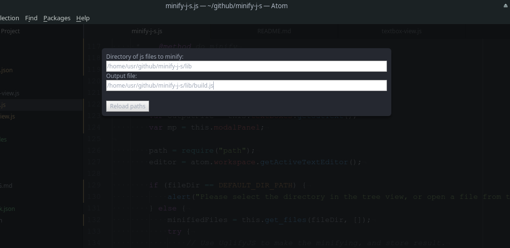

# minify-j-s package

A very comfortable GUI wrapper for Terser for atom text editor.

## Features

* Minify an entire directory
* "plug and play" (nothing to config, no tmp files)

## Install
Install via apm:
> $ apm install minify-j-s

via atom GUI:
Just go to settings (ctrl+,) and then to packages or install
and then install the package and enjoy. (it should be enabled by default)

## Usage
Press F4 and fill the fields.

Focused on a field press either:
Escape to cancel.
Enter to proceed.

*NOTE:* if your output js is in the directory, for now it will feed into itself. (this allows appending of old and new)

## License
I want to make it clear that I'm using Terser, so it's license also applies to this.
Additional to that the software itself MIT licensed, for more info check LICENSE.md

Enjoy!
